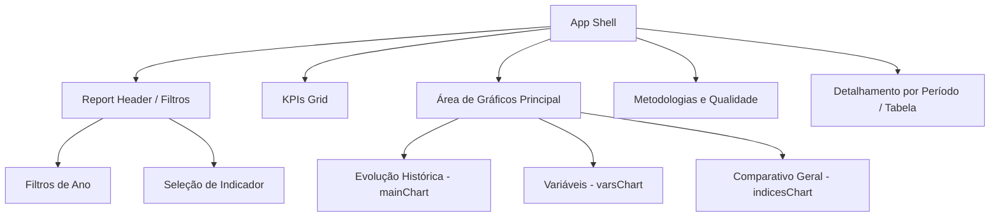

# Especificação de Design — Dashboard de Riscos de Integridade (CAESB)

Este documento descreve as diretrizes de design, a estrutura de componentes e as decisões arquiteturais adotadas no desenvolvimento do **Dashboard de Riscos de Integridade da CAESB**. O projeto foi estruturado com base nas fichas técnicas do Documento de Requisitos (PRGR/PRGA/PRTA) e projetado com foco em clareza analítica, simulando de forma fiel a interface visual e a usabilidade de relatórios corporativos do **Power BI**.

---

## 1. Visão Geral do Sistema e Requisitos de Negócio

O dashboard consolida e apresenta 10 indicadores de integridade (`I01` a `I10`). Cada indicador possui regras de negócio específicas que determinam sua temporalidade e lógica de cálculo:

*   **Indicadores Quadrimestrais (`I01`, `I02`, `I03`, `I07`, `I08`):** Coleta de variáveis brutas mensal e consolidação quadrimestral (3 quadrimestres por ano: Q1 = Jan-Abr, Q2 = Mai-Ago, Q3 = Set-Dez).
*   **Indicadores Anuais (`I04`, `I05`, `I06`, `I09`, `I10`):** Granularidade anual, com um único valor consolidado para o ano inteiro.
*   **Lógica de Integridade de Dados:** Os valores de todos os indicadores são calculados dinamicamente em tempo de execução a partir de dados brutos (V01, V02...). Isso permite realizar verificações de segurança lógica (ex: numerador não pode ultrapassar o denominador; valores negativos são proibidos) e assegura a rastreabilidade ponta a ponta.
*   **Simulação Temporal:** O sistema simula a data atual como **06/07/2026**. Nesse cenário, os dados de 2026 Q1 estão consolidados, 2026 Q2 está parcial/em andamento, e 2026 Q3 e o período anual de 2026 constam como pendentes.

---

## 2. Princípios Visuais & Design Tokens (Estilo Power BI)

O design foi concebido para simular a experiência de um relatório corporativo integrado do Power BI, distanciando-se de interfaces SaaS genéricas ou landing pages comerciais.

### Paleta de Cores e Identidade Visual (CAESB)
Utilizei a paleta institucional da CAESB, adaptada para alto contraste e legibilidade:

| Token CSS | Cor | Uso Principal |
| :--- | :---: | :--- |
| `--bg-app` | `#eae7f6` | Fundo geral da aplicação (cinza claro/azulado). |
| `--bg-card` | `#ffffff` | Fundo de todos os painéis e cartões (branco puro). |
| `--border-subtle` | `#d7e3ef` | Bordas discretas delimitando os cards e tabelas. |
| `--text-primary` | `#0d2438` | Texto principal, cabeçalhos e rótulos prioritários. |
| `--text-secondary` | `#5b7690` | Subtítulos, fórmulas e metadados auxiliares. |
| `--accent` | `#0072BC` | Destaque principal da marca (azul CAESB) e séries gráficas. |
| `--accent-dark` | `#04007d` | Gradientes de cabeçalho e marcações primárias. |
| `--positive` | `#1f9e6d` | Indicativos de conformidade / metas atingidas. |
| `--negative` | `#d64550` | Indicativos de alerta / estouro de limite aceitável. |

### Tipografia
Configurada de forma modular utilizando as fontes Montserrat e Montserrat Alternates:
*   **Títulos de Seção/Cards:** Compactos, com peso semi-bold (`600`) e cores sóbrias (`--text-primary`).
*   **KPIs:** Exibidos com destaque em tamanho grande, porém sem excessos decorativos, preservando a seriedade corporativa.

### Sombras e Bordas
*   `--radius-card: 14px`: Cantos suavemente arredondados que combinam consistência corporativa e visual moderno.
*   `--shadow-card: 0px 4px 40px rgba(0, 0, 0, 0.25)`: Sombra projetada sob os cards quando destacados ou expandidos.

---

## 3. Arquitetura e Decisões Técnicas

Para garantir portabilidade, facilidade de integração e máximo desempenho, adotei uma arquitetura com backend Flask (Python) e frontend modular:

1.  **Tecnologias Core (Frontend):** HTML5 semântico, CSS3 com variáveis nativas e JavaScript ES6 estruturado em padrão MVC simplificado.
2.  **Motor Gráfico Proprietário:** Os gráficos em linha, barras e comparativos são criados de forma nativa e renderizados manipulando o DOM e SVGs diretamente no [view.js](./static/js/view.js) e controlados em [controller.js](./static/js/controller.js). Isso elimina o peso de bibliotecas de terceiros (como Chart.js ou D3), mantendo o código leve e com estilização 100% controlada via CSS.
3.  **Servidor e Integração de Dados:** O backend foi desenvolvido em Flask (com a lógica central no diretório [app/](./app/) e executado através de [run.py](./run.py)), carregando dados diretamente de planilhas Excel estruturadas e servindo a página principal [index.html](./templates/index.html).

### 3.1. Divisão de Responsabilidades no Frontend (MVC)

Para facilitar a manutenção técnica e a escalabilidade, o código em [static/js/](./static/js/) é estruturado seguindo um padrão MVC simplificado:
*   **Model ([model.js](./static/js/model.js)):** Responsável pela gestão do estado local, seleção de anos vigentes e processamento das séries temporais brutas recebidas da API do Flask.
*   **View ([view.js](./static/js/view.js)):** Controla a criação dinâmica de nós SVG dos gráficos, montagem de KPIs e Tooltips, garantindo que toda a escrita no DOM seja segura.
*   **Controller ([controller.js](./static/js/controller.js)):** Orquestra o ciclo de vida inicial da página (escutando `DOMContentLoaded`), coordena eventos de cliques e ativa atualizações sincronizadas de Model e View.
*   **Componentes ([filter-toggle-button.js](./static/js/components/filter-toggle-button.js)):** Módulos desacoplados que estendem as capacidades nativas do HTML (Web Components), encapsulando comportamentos e eventos de forma isolada.

---

## 4. Componentes de Interface

A estrutura visual do painel é dividida de forma modular em [index.html](./templates/index.html):



### Detalhes dos Componentes
*   **Report Header (`.report-header`):** Contém os títulos do painel e a barra de ferramentas superior (`.filter-bar`), onde o usuário pode selecionar o indicador atual e filtrar os anos (2023, 2024, 2025, 2026) em tempo de execução.
*   **Aba de Filtros Vertical (`<filter-toggle-button>`):** Web Component nativo que encapsula a lógica e o estilo da aba vertical fixa à direita. Renderiza de forma segura (sem usar `innerHTML`) os SVGs de chevron e funil, além de gerenciar a abertura do painel de filtros e fechar automaticamente em cliques externos.
*   **KPIs Grid (`.kpis-grid`):** Apresenta cartões concisos com a Meta, o Limite Aceitável, o Período Fechado Vigente e o Status de Coleta Geral daquele indicador.
*   **Gráficos Customizados:**
    *   **Evolução Histórica (`#mainChart`):** Gráfico principal de linhas ou barras (dependendo do indicador) que plota o histórico temporal das variáveis e do índice final.
    *   **Variáveis (`#varsChart`):** Gráfico de barras horizontais detalhando os dados brutos de entrada do último período disponível.
    *   **Comparativo Geral (`#indicesChart`):** Visão agregada que posiciona o indicador selecionado em relação aos demais.
*   **Tabela de Detalhamento (`#dataTable`):** Exibe as informações em formato tabular detalhado com cálculo de variação período a período.
*   **Quadro de Registro de Riscos (`#riskRegisterBody`):** Painel interativo de exibição detalhada dos riscos mapeados (RI-01 a RI-07). Possui sua própria barra de ferramentas integrada para alternar filtros dinâmicos de Risco Inerente/Residual, exportar instantaneamente os registros ativos para arquivo CSV (`quadro_riscos.csv`) e aplicar micro-animações de entrada nas linhas (`tableRowEnter`).

---

## 5. Recursos de Interatividade & Usabilidade

Para emular as funcionalidades analíticas de ferramentas de BI tradicionais, desenvolvi componentes interativos ricos:

> [!TIP]
> **Interação com Visual individual (Visual Toolbar):** Cada card de gráfico possui uma barra de ferramentas integrada que oferece:
> *   **Exportar dados:** Gera e baixa instantaneamente um arquivo `.csv` estruturado contendo a série histórica daquele visual específico.
> *   **Alternar Tabela/Gráfico:** Renderiza uma tabela de dados interna no lugar do gráfico com um único clique.
> *   **Remover Visual:** Oculta dinamicamente o card do layout para personalização do espaço de trabalho.
> *   **Destaque (Highlight):** Destaca o visual aplicando contraste e foco, escurecendo suavemente os demais componentes.
> *   **Ordenação:** Permite classificar a série de forma ascendente ou descendente.

*   **Tooltip Inteligente:** Um elemento flutuante (`#ttip`) que segue o movimento do cursor do mouse nas áreas ativas dos gráficos, calculando dinamicamente sua posição e aplicando micro-transições via CSS para uma navegação fluida.
*   **Expansão Escalonada com Controle de Foco:** Ao clicar no botão de expandir de um gráfico, o sistema bloqueia o scroll da página, cria um overlay escurecido de fundo e redimensiona o card usando escalas pré-definidas adaptativas:
    *   `mainChart` (Evolução Histórica) expande mantendo escala de proporção padrão (`1.0x`) e ajustando limites.
    *   `varsChart` e `indicesChart` expandem aplicando fator de zoom de `1.5x` para detalhamento aprimorado.
    *   Suporte completo a fechamento via clique fora ou tecla `Escape`.

---

## 6. Boas Práticas e Ciclo de Vida do Dado

Toda a lógica foi desenvolvida de forma defensiva para evitar exibições inconsistentes ou erros de execução comuns a dashboards orientados a dados:

*   **Valores Nulos e Parciais:** O sistema identifica o status `"parcial"` ou `"pendente"` do período corrente e renderiza avisos amigáveis em vez de quebrar a exibição gráfica ou disparar erros aritméticos.
*   **Prevenção de Divisão por Zero:** Nas fórmulas em que o denominador é dinâmico (ex: total de denúncias), o algoritmo aplica validações para evitar resultados `Infinity` ou `NaN`, tratando-os como nulos ou apresentando alertas na interface.

### 6.1. Diretrizes de Segurança contra XSS (Cross-Site Scripting)

Como boa prática de engenharia de software e visando conformidade de segurança (CWE-79), implementei regras rígidas de manipulação segura de dados no frontend:
*   **Substituição do `innerHTML`:** Evita-se a injeção direta de strings dinâmicas (que possam conter scripts maliciosos) em propriedades `innerHTML` de elementos comuns.
*   **Esvaziamento Seguro:** Utiliza-se `replaceChildren()` para limpar eficientemente os elementos filhos de um nó no DOM.
*   **Criação de Nós Nativos:** Textos dinâmicos são inseridos de maneira limpa por meio da criação explícita de elementos (`document.createElement`) configurados via `textContent` ou `document.createTextNode()`.
*   **Sanitização com `DOMParser`:** Em trechos de código onde a conversão de strings complexas em HTML é indispensável, utiliza-se a API `DOMParser().parseFromString(..., 'text/html')` para gerar a árvore estrutural sob um contexto controlado e seguro antes de anexá-la ao DOM.

---

## 7. Como Executar o Projeto Localmente

O painel é servido por um backend Flask em Python estruturado de forma leve:

1.  **Pré-requisitos:** Certifique-se de possuir Python 3 instalado no sistema.
2.  **Ambiente Virtual:** Ative o ambiente virtual configurado no repositório:
    ```bash
    source .venv/bin/activate
    ```
3.  **Execução do Servidor:** Inicialize a aplicação executando o arquivo de entrada:
    ```bash
    python run.py
    ```
4.  **Acesso:** Abra o navegador e acesse o endereço fornecido (por padrão [http://127.0.0.1:5000](http://127.0.0.1:5000)).
